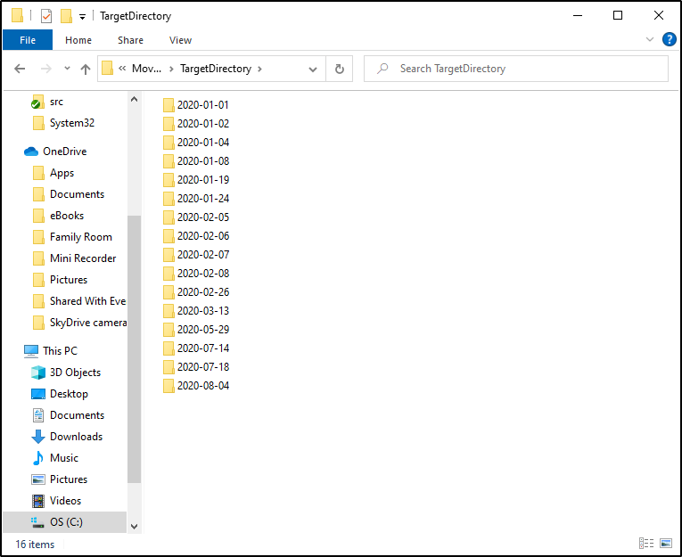

# Move Files Into Date Directories

[This PowerShell module](src/MoveFilesIntoDateDirectories.psm1) will scan all files in the `SourceDirectoryPath` and then move them into directories whose name is based on the file's LastWriteTime date.
Destination directories will be created if they don't already exist, using a name based upon the specified `DestinationDirectoriesDateScope`, and they will be created within the `DestinationDirectoryPath`.
It is acceptable for the `SourceDirectoryPath` and `DestinationDirectoryPath` to be the same directory path.

A common use-case of this module is to move photos into date-named directories based on when the photo was taken.

You can use the [Invoke-MoveFilesIntoDateDirectories.ps1](src/Invoke-MoveFilesIntoDateDirectories.ps1) script to easily provide parameters and run the cmdlet.

You can grab the latest stable version from [the Release page here](https://github.com/deadlydog/MoveFilesIntoDateDirectories/releases).

## Example

Some various files that were last updated on different dates:

The destination directory containing the same files after the script ran and moved them into month date-named directories based on their LastWriteTime:

## Changelog

See what's changed in the application over time by viewing [the changelog](Changelog.md).

## Donate

Buy me a hot apple cider for providing this script open source and for free :)

